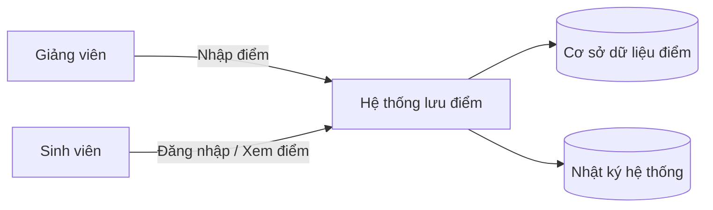

# Context Diagram (Mô tả ngữ cảnh)

## Gợi ý đọc sơ đồ
- **Giảng viên** là tác nhân có quyền nhập điểm.
- **Sinh viên** là tác nhân có quyền xem điểm.
- **Hệ thống lưu điểm** là nơi xử lý đăng nhập, truy vấn và hiển thị dữ liệu.
- **Cơ sở dữ liệu điểm** lưu thông tin cần bảo vệ.
- **Nhật ký hệ thống** hỗ trợ kiểm tra, truy vết sự cố.
